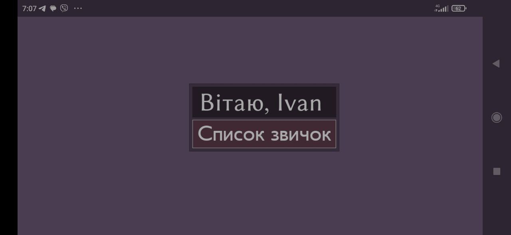
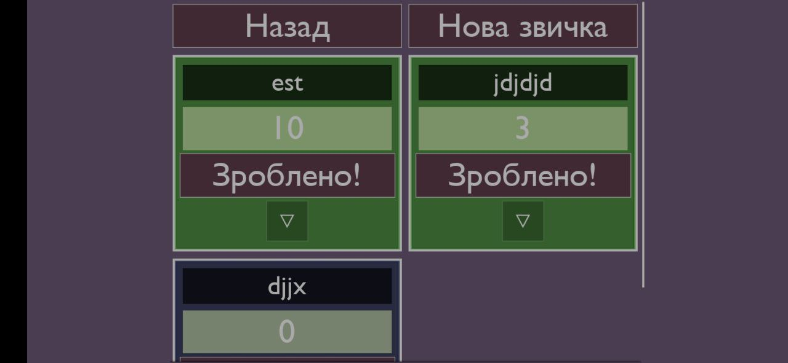

# VodkoMobileGame

Developed with Unreal Engine 5

# Habit Tracker

**Habit Tracker** — це Android-додаток для створення, збереження та відстеження виконання особистих звичок.

## Можливості

- Створення власних звичок з довільною назвою
- Відмітка виконання звички з підрахунком серії (стріку)
- Прискорений режим для тестування: звичку можна поновлювати кожні 5 секунд
- Видалення непотрібних звичок
- Збереження імені користувача, введеного при першому запуску (за потреби)
- Автоматичне збереження усіх звичок та їхнього прогресу між сесіями

## Скріншоти

## Установка

1. Завантаж `.apk` файл із [релізів](https://github.com/yourusername/yourrepo/releases)
2. Перед установкою увімкни дозвіл на встановлення з невідомих джерел у налаштуваннях телефону
3. Встанови додаток і запусти його

## Вимоги

- Android 7.0 або новіший
- Підтримка архітектури **arm64-v8a**

## Статус проєкту

Проєкт знаходиться в активній розробці. Основна функціональність реалізована, можливі оновлення та доповнення.

## Ліцензія

Цей проєкт ліцензовано під [MIT License](LICENSE).
